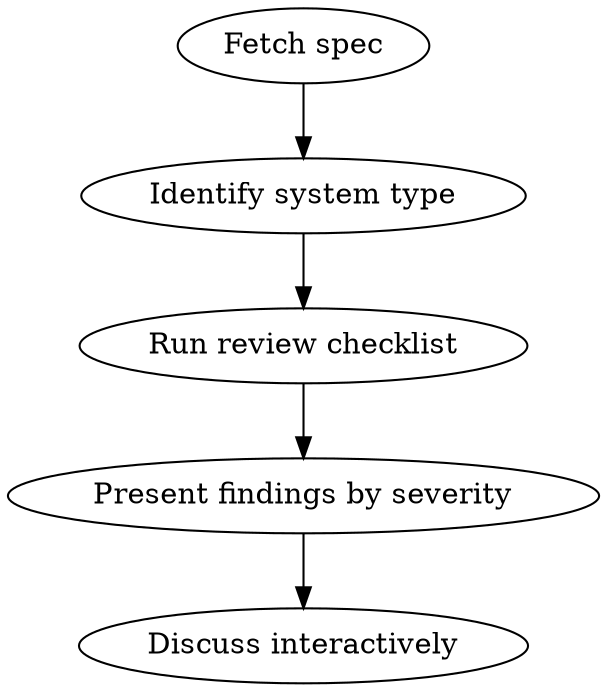

# Reviewing Design Specs

## Overview

Structured deep-dive into technical specs from any source (Confluence via acli, Markdown, pasted text). Catches architectural flaws, security/PII risks, caching disasters, GDPR gaps, and over-engineering **before a single line of code is written**.

Core principle: **pragmatic over dogmatic** — "simplest thing that works" beats "textbook perfect".

## When to Use

- User shares a Confluence page link or ID for review
- User shares a Markdown / text file containing a design spec
- User asks to "challenge" or "review" a design
- Before a design review meeting

**When NOT to use:** Code review (use code-reviewer), debugging (use systematic-debugging).

## Process

## 1. Fetch the Spec

| Source | How to fetch |
|--------|-------------|
| Confluence (ID ou URL) | `acli confluence page view <id>` |
| Fichier Markdown / texte | Lire le fichier directement |
| Contenu collé dans le chat | Utiliser tel quel |

Extract: **problem statement**, **proposed solution**, **migration plan**.

## 2. Identify System Type (Calibration)

Calibrates which checks apply and what to watch for first:

| Type | REST applies? | Key Focus | Major Red Flag |
|------|--------------|-----------|----------------|
| API | Yes | REST, status codes, idempotency, auth | PII leakage in URLs or logs |
| Web / SSR / MVC | **No** (HTTP semantics only) | GET safety, caching | User data leaked via CDN/Varnish |
| Background worker / Job | No | Idempotency, retries, dead letters | Lack of idempotency on re-runs |
| Data pipeline | No | Ordering, dedup, backpressure | Storage costs & GDPR purge strategy |

**Critical:** Do NOT apply REST constraints to server-rendered web pages. Verb-based routes (`/do_something`) are fine for MVC.

## 3. Review Checklist

### 🎯 Coherence
- Does the solution actually solve the stated problem?
- Contradictions between sections?
- Scope creep beyond stated objective?

### ✂️ Over-engineering
- Can this be simpler? What can be removed?
- Are abstractions justified by **current** needs (not hypothetical)?
- Layers that don't add value?

### ⚙️ Architecture & SOLID (where applicable)
- **SRP**: One reason to change per class/controller/service. Watch for god controllers accumulating unrelated routes, and services mixing distinct domains (e.g. a `CheckoutService` also handling PDF crypto generation, or URL building + signing).
- **OCP**: Can behavior be extended without modifying existing code?
- **DIP**: High-level modules depending on abstractions, not concrete implementations? Hidden side effects on unrelated modules?
- Don't force LSP/ISP unless clearly relevant.

### 🌐 HTTP Semantics (all web-facing systems)
- **GET must be safe** — no side effects. Prefetchers, crawlers, and antivirus follow links automatically.
- State changes → **prefer POST**. If GET with side-effects is unavoidable (email links), require idempotency or nonce / one-time tokens as fallback.
- REST resource modeling **only for APIs**.

### 🛡️ Security & Privacy (GDPR)
- **Auth on every endpoint?**
- **Token / signature**: TTL proportional to criticality (destructive actions → short TTL), replay protection (nonce for critical actions).
- **PII in logs**: no emails, passwords, tokens, or session IDs written to application logs.
- **IDOR**: sequential IDs in public URLs? Prefer opaque tokens or signed identifiers.
- **GDPR — Data Minimization**: only the data strictly needed?
- **GDPR — Right to be Forgotten**: technical plan for deletion / anonymization?
- **Input validation** at every system boundary.

### 🔥 Caching & Edge Caching (CDN / Varnish)
- If a CDN / Varnish layer exists, do pages with **user-specific data** have explicit `Cache-Control: private, no-store` or `Vary: Cookie` headers? **This is the #1 source of catastrophic data leaks** (logged-in user A sees user B's data).
- Cache invalidation strategy clear?
- Don't force caching where it adds complexity for no measurable gain.

### 🚀 Performance & Scalability
- **Run cost / infrastructure**: heavy cross-region egress, inefficient DB scan patterns, unbounded fan-out?
- **Architectural N+1**: cascade of synchronous service calls that will destroy p99 latency? Can it be batched / parallelised / async?

### 🛠️ Robustness, Observability & Migration
- **Edge cases**: 3rd party API down → circuit breaker or degraded mode?
- **Retry storms / dead-letter handling** for async work.
- **Observability**: specific metrics / alerts defined to **prove the feature works** in production?
- **Migration & Rollback**: deployable without downtime? Schema change backward compatible (Blue/Green friendly)? TTL of old system / coexistence strategy?

### 🧩 Missing Use Cases
- Empty state, concurrency, timeout, partial failure?
- What happens to in-flight work during deploy?

### 🎯 Domain-specific concerns

The generic checklist above misses concerns specific to the domain. Pick the relevant lens(es) and add the appropriate checks:

| Domain | Specific checks |
|--------|----------------|
| Outbound email | Unsubscribe link + opt-out table (CAN-SPAM/RGPD), IP/domain warm-up, deliverability metrics (bounce, spam, open rate), DKIM/SPF/DMARC |
| Public web (SSR) | Accessibility (WCAG), SEO impact (canonical, robots, sitemaps), Core Web Vitals, i18n |
| Public API | Versioning strategy, deprecation policy, rate limiting, OpenAPI/SDK consistency |
| Data pipeline | Schema evolution / backward compat, replay strategy, late-arriving data, exactly-once vs at-least-once |
| Auth / Identity | Session fixation, password reset flow, MFA bypass, account enumeration |
| Payments / Billing | Idempotency keys, double-charge prevention, reconciliation, PCI scope |
| Mobile client | Forced upgrade strategy, offline-first, app store review timing |
| Search / Recommandation | Cold start, freshness, feedback loop bias, A/B test plan |

Don't apply lenses that don't fit — pick what's actually relevant for this spec.

## 4. Present Findings

Structure by severity to surface the most critical points first:

- 🔴 **Bloquant (S1)** — Must fix before implementation. Security holes, PII leaks via cache, fundamental coherence/logic flaws that would break production.
- 🟡 **Important (S2)** — Strong recommendation. Missing idempotency, SRP violations, missing observability, technical debt.
- 🔵 **Suggestion (S3)** — Nice to have. Naming, minor perf gains, simplification.

For each finding: **problem** → **why it matters** → **concrete alternative**.

## 5. Discuss Interactively

Don't dump every finding at once. Present, then let the user push back. Some points may not apply to their context — the user knows their codebase constraints better than you. Adjust.

## Anti-patterns to Watch For

- **The Dogmatist** — Forcing complex patterns (full Hexagonal, DDD, CQRS) on a simple isolated utility.
- **Happy Path Bias** — Ignoring failure modes, retry storms, dead-letter handling.
- **The "Vacuum" Design** — A perfect system on paper that ignores how it must coexist with legacy data and existing services.
- **REST-on-MVC** — Applying REST constraints to server-rendered web routes.
- **Reverse over-engineering** — Flagging over-engineering, then suggesting 3 layers of abstraction as the fix.
- **Reviewing what's not in the spec** — Stay scoped to what was actually proposed.

## Posting Feedback to Confluence

When the user wants to comment directly on the spec:
- **Concise**: 2-4 sentences per point.
- **Actionable**: problem + concrete alternative.
- **Respectful**: "Proposition :" not "Erreur :".
- Use `acli confluence page comment <id> -b "message"` to post.
