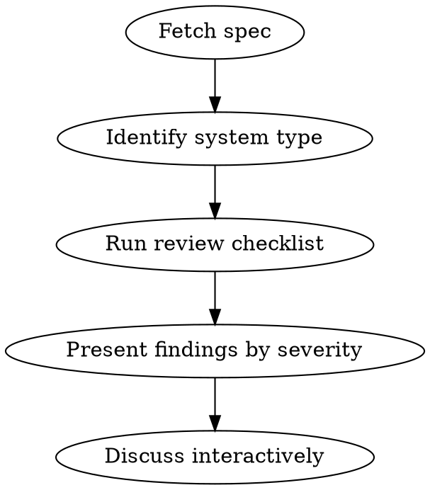

# Reviewing Design Specs

## Overview

Structured review of technical design specs from any source (Confluence via acli, Markdown file, or pasted text). Catch incoherence, over-engineering, missing edge cases, and technical blind spots before implementation.

## When to Use

- User shares a Confluence page link or ID for review
- User shares a Markdown or text file containing a design spec
- User asks to "challenge" or "review" a design
- Before a design review meeting

**When NOT to use:** Code review (use code-reviewer), debugging (use systematic-debugging)

## Process

### 1. Fetch the Spec

Adapt to the source provided by the user:

| Source | How to fetch |
|--------|-------------|
| Confluence (ID ou URL) | `acli confluence page view <id>` |
| Fichier Markdown / texte | Lire le fichier directement |
| Contenu collé dans le chat | Utiliser tel quel |

Extract: problem statement, proposed solution, migration plan.

### 2. Identify System Type

This calibrates which checks apply:

| Type | REST applies? | Key focus |
|------|--------------|-----------|
| API | Yes | REST, status codes, idempotency |
| Web routes (SSR/MVC) | **No** | HTTP semantics only (GET safety) |
| Background service | No | Idempotency, retry, failure modes |
| Data pipeline | No | Ordering, dedup, backpressure |

**Critical:** Do NOT apply REST constraints to server-rendered web pages. Verb-based routes (`/do_something`) are fine for MVC.

### 3. Review Checklist

#### Coherence
- Does the solution solve the stated problem?
- Contradictions between sections?
- Scope creep beyond stated objective?

#### Over-engineering
- Can this be simpler? What can be removed?
- Are abstractions justified by **current** needs (not hypothetical)?
- Layers that don't add value?

#### Missing Use Cases
- Error scenarios: what happens when X fails?
- Edge cases: empty state, concurrency, timeout
- Migration: rollback plan? coexistence strategy? TTL of old system?
- Monitoring: how do you know it works in prod?

#### SOLID (where applicable)
- **SRP**: One reason to change per class/controller/service. Watch for god controllers accumulating unrelated routes, and services mixing distinct responsibilities (e.g. URL building + crypto)
- **OCP**: Can behavior be extended without modifying existing code?
- **DIP**: High-level modules depending on abstractions?
- Don't force LSP/ISP unless clearly relevant

#### HTTP Semantics (all web-facing systems)
- **GET must be safe** — no side effects. Prefetchers, crawlers, and antivirus follow links automatically
- State changes → **prefer POST**. If GET with side-effects is unavoidable (e.g. email links), require idempotency or nonce/one-time tokens as fallback
- REST resource modeling only for APIs

#### Caching (only if applicable)
- Pages/responses that could benefit from caching?
- Cache invalidation strategy?
- Don't force caching where it adds complexity for no gain

#### Security
- Auth on every endpoint?
- Token/signature: expiration proportionnelle à la criticité (actions destructives → TTL court), replay protection (nonce for critical actions)
- Sensitive data exposure: sequential IDs in URLs (IDOR risk), PII in logs
- Input validation at system boundaries

### 4. Present Findings

Structure by severity:

1. **Bloquant** — Must fix before implementation (security holes, fundamental incoherence)
2. **Important** — Strong recommendation (SRP violations, missing error handling)
3. **Suggestion** — Nice to have (naming, structure)

For each: problem, why it matters, concrete alternative.

### 5. Discuss Interactively

Don't dump all findings at once. Present, then let the user challenge back. Some points may not apply to their context. Adjust — the user knows their codebase constraints better than you.

## Anti-patterns

- Applying REST to non-API routes
- Demanding patterns the codebase doesn't use
- Flagging over-engineering then suggesting 3 layers of abstraction
- Reviewing what's not in the spec
- Being dogmatic over pragmatic — "simplest thing that works" beats "textbook perfect"

## Posting Feedback to Confluence

When user wants to comment on the spec:
- **Concise**: 2-4 sentences per point
- **Actionable**: problem + concrete alternative
- **Respectful**: "Proposition :" not "Erreur :"
- Use `acli confluence page comment <id> -b "message"` pour ajouter un commentaire
