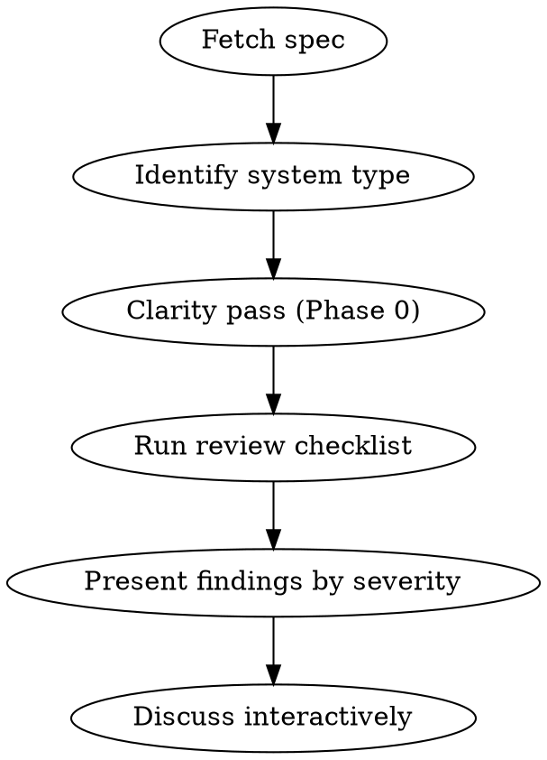

# Reviewing Design Specs

## Overview

Structured deep-dive into technical specs from any source (Confluence via acli, Markdown, pasted text). Catches architectural flaws, security/PII risks, caching disasters, GDPR gaps, and over-engineering **before a single line of code is written**.

Core principle: **pragmatic over dogmatic** — "simplest thing that works" beats "textbook perfect".

## When to Use

- User shares a Confluence page link or ID for review
- User shares a Markdown / text file containing a design spec
- User asks to "challenge" or "review" a design
- Before a design review meeting

**When NOT to use:** Code review (use code-reviewer), debugging (use systematic-debugging).

## Modes

- **Report mode (default)**: emit ambiguity findings as `S0 Clarity` entries alongside `S1/S2/S3`. No user prompts.
- **Interactive mode** (`--interactive`): during Phase 0 (Clarity Pass), present unresolved ambiguities to the user via `AskUserQuestion` before running the severity checklist. Resolved answers fold into the final report; unanswered items stay as `S0 Clarity` findings.

Trigger: `--interactive` flag in invocation, or user says "interactive", "ask me questions".

## Process



## 1. Fetch the Spec

| Source | How to fetch |
|--------|-------------|
| Confluence (ID or URL) | `acli confluence page view <id>` |
| Markdown / text file | Read the file directly |
| Content pasted in chat | Use as-is |

Extract: **problem statement**, **proposed solution**, **migration plan**.

## 2. Identify System Type (Calibration)

Calibrates which checks apply and what to watch for first:

| Type | REST applies? | Key Focus | Major Red Flag |
|------|--------------|-----------|----------------|
| API | Yes | REST, status codes, idempotency, auth | PII leakage in URLs or logs |
| Web / SSR / MVC | **No** (HTTP semantics only) | GET safety, caching | User data leaked via CDN/Varnish |
| Background worker / Job | No | Idempotency, retries, dead letters | Lack of idempotency on re-runs |
| Data pipeline | No | Ordering, dedup, backpressure | Storage costs & GDPR purge strategy |

**Critical:** Do NOT apply REST constraints to server-rendered web pages. Verb-based routes (`/do_something`) are fine for MVC.

## 3. Clarity Pass (Socratic)

**Purpose:** Surface what's implicit, ambiguous, or missing — *before* judging quality. A spec that's unclear can't be reviewed for correctness, only for vibes.

This phase asks: **"Is the spec complete enough that two engineers reading it would build the same thing?"** Inspired by the Socratic interview pattern (ouroboros): target ambiguity tracks, ask the highest-impact question per track, prefer "what's missing?" over "what's wrong?".

### What to detect

Scan the spec for these classes of ambiguity (each becomes a candidate `S0 Clarity` finding):

| Class | Signal | Example |
|-------|--------|---------|
| **Vague vocabulary** | "simple", "fast", "scalable", "robust", "best-effort" without metric | "Must be performant" → what p50/p99? what target load? |
| **Passive voice / unowned action** | "will be handled", "is migrated" — no actor named | "Errors are surfaced" → by whom? where? which channel? |
| **Implicit decision** | Tech choice stated without alternatives considered or justification | "We use Kafka" → why not SQS / Redis Streams? known trade-off? |
| **Undefined boundary** | Scope mentioned but limit not stated | "Supports large payloads" → max bytes? truncation policy? |
| **Missing actor / SLO / volume** | Sections absent: ownership, SLO, target load, error budget | No mention of who owns the service post-launch |
| **Implicit "obvious"** | Author assumes shared context — terms used without definition | "The premium user" → criterion? table? source of truth? |
| **Out-of-scope unstated** | Features mentioned in passing but never explicitly excluded | "No refunds for now" never written, only implied |
| **Migration gaps** | New system described, coexistence with legacy not | Legacy system TTL? gradual cutover? rollback path? |
| **Edge cases in passing** | "Shouldn't happen but" without follow-up | "If the webhook double-fires" → where is idempotency defined? |
| **Missing success metrics** | No way to prove the feature works post-deploy | No metric named, no alert threshold |

### Heuristics — pattern matchers

Quick regex/keyword passes to seed the ambiguity ledger:

- Vague adjectives: `simple|fast|scalable|robust|performant|secure|reliable|efficient` not followed by a number in the same sentence
- Orphan passives: `will be|is|gets` + action verb with no agent (`handled`, `processed`, `migrated`, `monitored`)
- Modalities: `should|normally|ideally|in principle` — fuzzy intent signal
- Mentioned-once: critical business term cited 1× without definition → likely implicit "obvious"
- Missing sections vs expected template: rollback, observability, SLO, ownership, target load, migration plan

### Building the Ambiguity Ledger

Group findings by **track** (don't dump 30 questions in a flat list). Typical tracks:

- **Scope** — what is in/out
- **Constraints** — perf, load, SLA, cost
- **Tech decisions** — choices and rejected alternatives
- **Actors & ownership** — who does what, who maintains
- **Verification** — how we prove it works
- **Migration** — coexistence, rollback, legacy TTL

Per track, list 1–3 highest-impact ambiguities. Cap total at ~8 items to avoid noise.

### Report mode (default)

Emit findings as `S0 Clarity` entries in the final report, before `S1/S2/S3`:

```
🔍 S0 Clarity — Ambiguities to resolve before quality review

[Track: Constraints]
- "Must be performant" — no numeric target.
  Question: acceptable p99? target load (RPS / volume / concurrency)?
  Impact if unresolved: cannot judge whether the proposed architecture holds under load.

[Track: Migration]
- Cutover mentioned but legacy system TTL not defined.
  Question: how long do both systems coexist? what triggers retirement?
  Impact if unresolved: no clear rollback path, risk of irreversible freeze.
```

For each: **observation** → **question(s)** → **impact if unresolved**.

### Interactive mode (`--interactive`)

Before running the severity checklist, present the ambiguity ledger to the user via `AskUserQuestion`. Rules:

- **One track at a time**, not 8 questions in one batch — preserves Socratic rhythm.
- **Max 4 options per question** (AskUserQuestion limit). If a track has more candidates, ask the highest-impact one first, then follow up.
- **Always rely on AskUserQuestion's built-in "Other" option** so user can free-text.
- **Always include a "Deliberately unspecified / out of scope" option** — sometimes the gap *is* the answer.
- **Skip the question** if user says "skip" — keep as `S0 Clarity` finding in final report.

Format per question:

```json
{
  "questions": [{
    "question": "Spec says 'must be performant' but gives no number. What is the p99 target under nominal load?",
    "header": "Constraints — perf",
    "options": [
      {"label": "< 100ms p99 at 100 RPS", "description": "Standard interactive target"},
      {"label": "< 500ms p99 at 1k RPS", "description": "Public API target"},
      {"label": "Best-effort, no formal SLO", "description": "Internal, low-criticality service"},
      {"label": "Deliberately unspecified", "description": "To be defined later, keep as S0"}
    ],
    "multiSelect": false
  }]
}
```

After each answer:
- Fold the resolved fact into the spec's working interpretation (used by Phase 4 checklist).
- Log it in the final report under `✅ Clarifications gathered` (audit trail of what was assumed).
- Move to next track.

### When to skip Phase 0 entirely

- Spec is < 1 page **and** scope is trivial (rename, isolated bugfix doc).
- User explicitly says "skip clarity, checklist only".

Otherwise: always run Phase 0, at least in report mode. A 30-second scan that finds 3 implicit assumptions is cheaper than reviewing the wrong design.

## 4. Review Checklist

### 🎯 Coherence
- Does the solution actually solve the stated problem?
- Contradictions between sections?
- Scope creep beyond stated objective?

### ✂️ Over-engineering
- Can this be simpler? What can be removed?
- Are abstractions justified by **current** needs (not hypothetical)?
- Layers that don't add value?

### ⚙️ Architecture & SOLID (where applicable)
- **SRP**: One reason to change per class/controller/service. Watch for god controllers accumulating unrelated routes, and services mixing distinct domains (e.g. a `CheckoutService` also handling PDF crypto generation, or URL building + signing).
- **OCP**: Can behavior be extended without modifying existing code?
- **DIP**: High-level modules depending on abstractions, not concrete implementations? Hidden side effects on unrelated modules?
- Don't force LSP/ISP unless clearly relevant.

### 🌐 HTTP Semantics (all web-facing systems)
- **GET must be safe** — no side effects. Prefetchers, crawlers, and antivirus follow links automatically.
- State changes → **prefer POST**. If GET with side-effects is unavoidable (email links), require idempotency or nonce / one-time tokens as fallback.
- REST resource modeling **only for APIs**.

### 🛡️ Security & Privacy (GDPR)
- **Auth on every endpoint?**
- **Token / signature**: TTL proportional to criticality (destructive actions → short TTL), replay protection (nonce for critical actions).
- **PII in logs**: no emails, passwords, tokens, or session IDs written to application logs.
- **IDOR**: sequential IDs in public URLs? Prefer opaque tokens or signed identifiers.
- **GDPR — Data Minimization**: only the data strictly needed?
- **GDPR — Right to be Forgotten**: technical plan for deletion / anonymization?
- **Input validation** at every system boundary.

### 🔥 Caching & Edge Caching (CDN / Varnish)
- If a CDN / Varnish layer exists, do pages with **user-specific data** have explicit `Cache-Control: private, no-store` or `Vary: Cookie` headers? **This is the #1 source of catastrophic data leaks** (logged-in user A sees user B's data).
- Cache invalidation strategy clear?
- Don't force caching where it adds complexity for no measurable gain.

### 🚀 Performance & Scalability
- **Run cost / infrastructure**: heavy cross-region egress, inefficient DB scan patterns, unbounded fan-out?
- **Architectural N+1**: cascade of synchronous service calls that will destroy p99 latency? Can it be batched / parallelised / async?

### 🛠️ Robustness, Observability & Migration
- **Edge cases**: 3rd party API down → circuit breaker or degraded mode?
- **Retry storms / dead-letter handling** for async work.
- **Observability**: specific metrics / alerts defined to **prove the feature works** in production?
- **Migration & Rollback**: deployable without downtime? Schema change backward compatible (Blue/Green friendly)? TTL of old system / coexistence strategy?

### 🧩 Missing Use Cases
- Empty state, concurrency, timeout, partial failure?
- What happens to in-flight work during deploy?

### 🎯 Domain-specific concerns

The generic checklist above misses concerns specific to the domain. Pick the relevant lens(es) and add the appropriate checks:

| Domain | Specific checks |
|--------|----------------|
| Outbound email | Unsubscribe link + opt-out table (CAN-SPAM/RGPD), IP/domain warm-up, deliverability metrics (bounce, spam, open rate), DKIM/SPF/DMARC |
| Public web (SSR) | Accessibility (WCAG), SEO impact (canonical, robots, sitemaps), Core Web Vitals, i18n |
| Public API | Versioning strategy, deprecation policy, rate limiting, OpenAPI/SDK consistency |
| Data pipeline | Schema evolution / backward compat, replay strategy, late-arriving data, exactly-once vs at-least-once |
| Auth / Identity | Session fixation, password reset flow, MFA bypass, account enumeration |
| Payments / Billing | Idempotency keys, double-charge prevention, reconciliation, PCI scope |
| Mobile client | Forced upgrade strategy, offline-first, app store review timing |
| Search / Recommandation | Cold start, freshness, feedback loop bias, A/B test plan |

Don't apply lenses that don't fit — pick what's actually relevant for this spec.

## 5. Present Findings

Structure by severity to surface the most critical points first:

- 🔍 **Clarity (S0)** — Ambiguity / implicit / missing info. Cannot be reviewed for correctness until resolved. Listed first; in interactive mode many of these are already answered before this phase.
- 🔴 **Blocking (S1)** — Must fix before implementation. Security holes, PII leaks via cache, fundamental coherence/logic flaws that would break production.
- 🟡 **Important (S2)** — Strong recommendation. Missing idempotency, SRP violations, missing observability, technical debt.
- 🔵 **Suggestion (S3)** — Nice to have. Naming, minor perf gains, simplification.

For each S1/S2/S3 finding: **problem** → **why it matters** → **concrete alternative**.
For each S0 finding: **observation** → **question(s)** → **impact if unresolved**.

If interactive mode was used, append a `✅ Clarifications gathered` section listing user-confirmed answers (audit trail for the design review meeting).

## 6. Discuss Interactively

Don't dump every finding at once. Present, then let the user push back. Some points may not apply to their context — the user knows their codebase constraints better than you. Adjust.

## Anti-patterns to Watch For

- **The Dogmatist** — Forcing complex patterns (full Hexagonal, DDD, CQRS) on a simple isolated utility.
- **Happy Path Bias** — Ignoring failure modes, retry storms, dead-letter handling.
- **The "Vacuum" Design** — A perfect system on paper that ignores how it must coexist with legacy data and existing services.
- **REST-on-MVC** — Applying REST constraints to server-rendered web routes.
- **Reverse over-engineering** — Flagging over-engineering, then suggesting 3 layers of abstraction as the fix.
- **Reviewing what's not in the spec** — Stay scoped to what was actually proposed.

## Posting Feedback to Confluence

When the user wants to comment directly on the spec:
- **Concise**: 2-4 sentences per point.
- **Actionable**: problem + concrete alternative.
- **Respectful**: frame as "Proposal:" not "Mistake:". Match the spec's language when posting (if spec is in French, post in French).
- Use `acli confluence page comment <id> -b "message"` to post.
